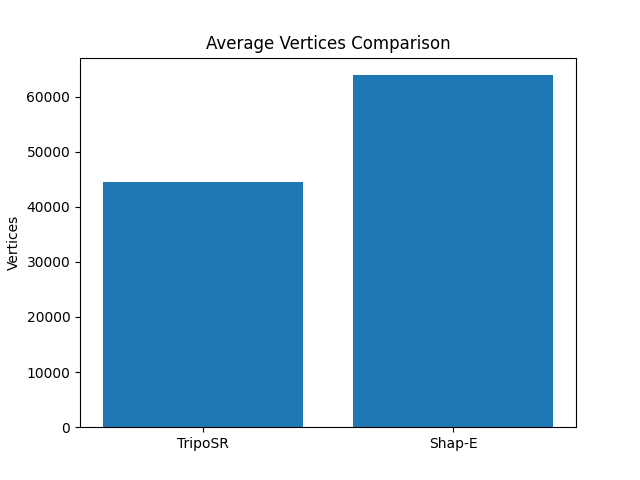
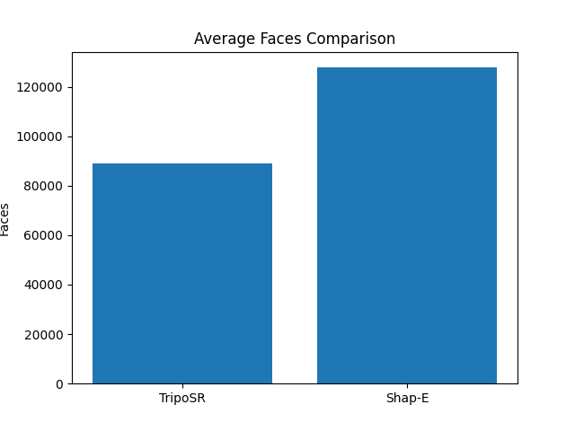
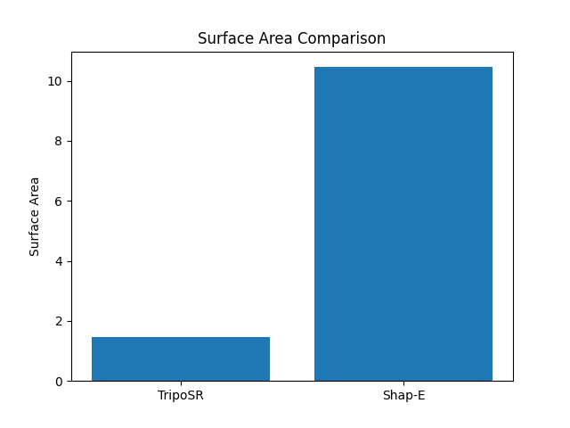
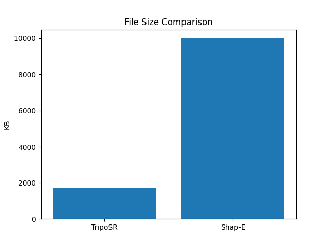
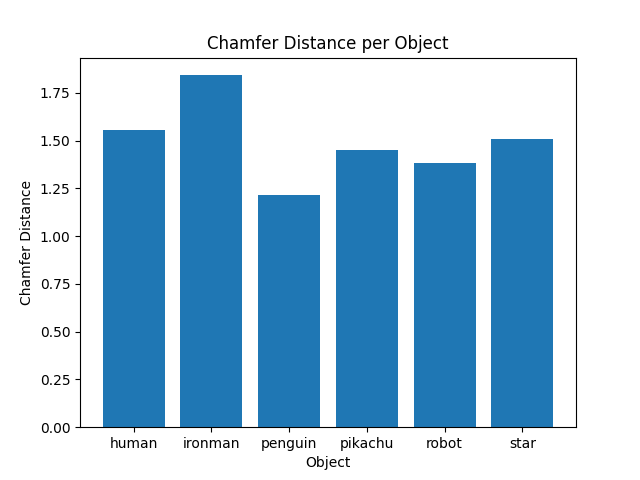

# Benchmarking Image-to-3D Reconstruction Models

## A Comparative Study of TripoSR and Shap-E in a GPU-Accelerated FastAPI Architecture

This repository provides a benchmarking framework for evaluating **Image-to-3D reconstruction models**, focusing on a comparative study between **TripoSR** and **Shap-E**.

The system is deployed using a **GPU-accelerated FastAPI architecture**, enabling efficient inference and automated benchmarking of generated 3D meshes.

The benchmarking pipeline evaluates reconstruction quality, mesh complexity, and model performance using multiple geometric metrics and inference time measurements.

---

# Project Overview

Recent advances in generative AI have enabled systems capable of converting images into detailed 3D models. These models are useful for many real-world applications including:

* Augmented Reality (AR)
* Virtual Reality (VR)
* Game development
* Robotics perception
* Digital asset generation
* Metaverse environments

However, comparing different reconstruction models requires quantitative evaluation metrics.

This project implements a **benchmarking framework** that compares **TripoSR** and **Shap-E** outputs using:

* Mesh statistics
* Chamfer Distance
* File size analysis
* GPU inference latency

---

# Repository Structure

```
benchmark-image-to-3d/

├── triposr_outputs/
│   └── *.glb
│
├── shape_outputs/
│   └── *.obj
│
├── benchmark.py
│
├── benchmark_results.csv
│
├── plots/
│   ├── vertices_comparison.png
│   ├── faces_comparison.png
│   ├── surface_area_comparison.png
│   ├── file_size_comparison.png
│   └── chamfer_distance.png
│
└── README.md
```

---

# Evaluation Metrics

The benchmarking system evaluates several geometric and computational metrics.

## 1. Vertices Count

Represents the number of vertices in the generated mesh.

Higher vertex counts typically indicate more detailed geometry but increase rendering cost.
### Vertices Comparison


---

## 2. Faces Count

Represents the number of triangular faces in the mesh.

More faces often improve geometric fidelity but increase computational complexity.
### Faces Comparison


---

## 3. Surface Area

Measures the total surface area of the generated 3D object.

This helps compare how much geometric space the reconstructed object occupies.
### Surface Area Comparison


---

## 4. File Size

Represents the storage requirement of the generated mesh file.

Smaller file sizes are beneficial for real-time rendering and web applications.

### File Size Comparison


---

## 5. Chamfer Distance

Chamfer Distance measures the similarity between two point clouds sampled from two meshes.

Lower Chamfer Distance indicates higher geometric similarity.

The Chamfer Distance is defined as:

```
CD(P,Q) = (1/|P|) Σp∈P minq∈Q ||p−q||² + (1/|Q|) Σq∈Q minp∈P ||q−p||²
```

Where:

P = sampled points from mesh 1
Q = sampled points from mesh 2

### Chamfer Distance per Object


---

# Installation

Clone the repository:

```
git clone https://github.com/yourusername/benchmark-image-to-3d.git

cd benchmark-image-to-3d
```

Install dependencies:

```
pip install trimesh
pip install pandas
pip install matplotlib
pip install torch
```

Optional dependency for faster mesh processing:

```
pip install pyembree
```

---

# Running the Benchmark

Place generated meshes in the following folders:

```
triposr_outputs/
shape_outputs/
```

Supported formats:

```
TripoSR  → .glb
Shap-E   → .obj
```

Run the benchmarking script:

```
python benchmark.py
```

---

# Experimental Setup

The experiments were conducted using a **GPU-accelerated environment** with a FastAPI backend for model inference.

Pipeline workflow:

1. Input image is processed by the reconstruction model.
2. The model generates a 3D mesh.
3. Meshes are saved in GLB or OBJ format.
4. The benchmarking script loads meshes and samples surface points.
5. Chamfer Distance is computed.
6. Mesh statistics are extracted.
7. Visualization plots are generated.

---
## Inference Time Benchmark

To evaluate performance, we measured the **inference latency of TripoSR and Shap-E** in a GPU-accelerated environment.
Inference time was recorded in both **milliseconds (ms)** and **seconds (s)**.

---

# TripoSR Inference Time

The TripoSR model was executed multiple times to measure stable runtime performance.

| Run | Time (ms) | Time (s) |
| --- | --------- | -------- |
| 1   | 13221.39  | 13.22    |
| 2   | 12873.53  | 12.87    |
| 3   | 14877.70  | 14.88    |
| 4   | 14984.51  | 14.98    |
| 5   | 13366.16  | 13.37    |
| 6   | 14191.75  | 14.19    |
| 7   | 13213.71  | 13.21    |
| 8   | 13024.33  | 13.02    |
| 9   | 13949.23  | 13.95    |
| 10  | 12610.01  | 12.61    |
| 11  | 12534.31  | 12.53    |

### Average TripoSR Inference Time

* **13.53 seconds**
* **13,530 ms**

---

# Shap-E Inference Time

The Shap-E model inference was measured across multiple input objects.

| Object   | Time (s) | Time (ms) |
| -------- | -------- | --------- |
| Iron Man | 34.67    | 34678.76  |
| Human    | 35.17    | 35174.41  |
| Penguin  | 35.35    | 35351.25  |
| Star     | 34.38    | 34389.11  |
| Robot    | 35.58    | 35581.37  |

### Average Shap-E Inference Time

* **35.03 seconds**
* **35,035 ms**

---

# Model Performance Comparison

| Model       | Average Inference Time (s) | Average Inference Time (ms) |
| ----------- | -------------------------- | --------------------------- |
| **TripoSR** | **13.53**                  | **13,530**                  |
| **Shap-E**  | **35.03**                  | **35,035**                  |

### Key Observation

* **TripoSR is approximately 2.6× faster than Shap-E**
* TripoSR is optimized for **fast single-image 3D reconstruction**
* Shap-E focuses more on **generative modeling quality and diversity**

---
# Output Files

The benchmarking script generates:

### Results Table

```
benchmark_results.csv
```

Example structure:

| Object | TripoSR Vertices | ShapE Vertices | Chamfer Distance |
| ------ | ---------------- | -------------- | ---------------- |
| robot  | 7421             | 5230           | 0.014            |

---

### Visualization Graphs

The system automatically generates comparison plots:

* Vertices comparison
* Faces comparison
* Surface area comparison
* File size comparison
* Chamfer distance per object

Generated files:

```
vertices_comparison.png
faces_comparison.png
surface_area_comparison.png
file_size_comparison.png
chamfer_distance.png
```

---

# Technologies Used

* Python
* PyTorch
* Trimesh
* Pandas
* Matplotlib
* FastAPI
* CUDA GPU acceleration

---

# Applications

This benchmarking framework can be used for:

* Evaluating generative 3D models
* Comparing reconstruction algorithms
* Research in text-to-3D and image-to-3D generation
* Testing geometry quality of neural reconstruction systems
* Performance analysis of GPU-based inference pipelines

---

# Conclusion

This project presented a benchmarking framework for evaluating **Image-to-3D reconstruction models**, specifically comparing **TripoSR** and **Shap-E** within a GPU-accelerated environment.

The experimental analysis considered several key metrics, including **mesh complexity (vertices and faces), surface area, file size, Chamfer Distance, and inference time**. These metrics provide insight into both the **quality of the generated 3D meshes and the computational efficiency of each model**.

From the experimental results, several important observations were made:

* **TripoSR demonstrated significantly faster inference performance**, with an average runtime of approximately **13.53 seconds per object**.
* **Shap-E required an average of about 35.03 seconds per object**, making it roughly **2.6× slower than TripoSR** in the tested environment.
* TripoSR produced meshes with **higher geometric complexity**, reflected in larger vertex and face counts.
* Shap-E generated comparatively **lighter mesh structures**, resulting in smaller file sizes but sometimes reduced geometric detail.
* Chamfer Distance evaluation provided a quantitative measure of geometric similarity between the generated meshes.

Overall, the benchmarking results indicate that **TripoSR is highly suitable for fast and efficient single-image 3D reconstruction**, particularly in applications requiring **interactive performance or real-time generation**.

In contrast, **Shap-E focuses more on generative modeling and flexibility**, making it useful for scenarios where **generation diversity is more important than inference speed**.

This benchmarking framework provides a practical foundation for evaluating emerging **image-to-3D and generative 3D models**, and it can be extended to include additional models and evaluation metrics in future research.

Future work may include integrating more advanced evaluation techniques such as **F-score for point cloud similarity, mesh intersection-over-union (IoU), texture quality assessment, and GPU memory utilization analysis**. Additionally, the framework can be expanded to benchmark newer generative 3D systems such as **DreamFusion, Magic3D, and other diffusion-based 3D reconstruction models**.

Overall, this project contributes a structured and reproducible pipeline for **quantitative benchmarking of modern 3D reconstruction models**, helping researchers and developers better understand the trade-offs between **generation quality, mesh complexity, and computational efficiency**.

----
